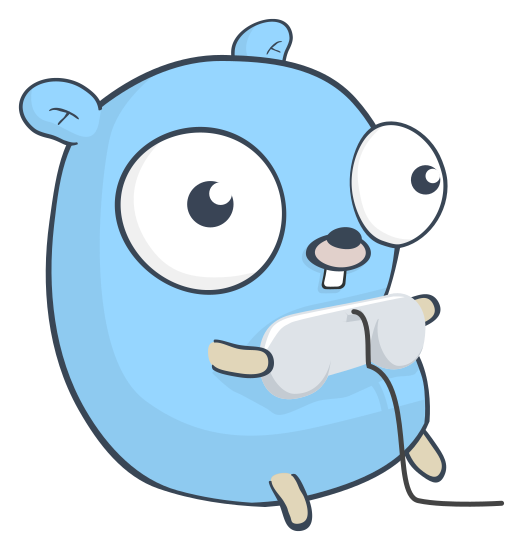

# Hi! I'm @BarkinBalci also here is today's gopher 😊

<!-- GOPHER_START -->

<!-- GOPHER_END -->

---

## 🚀 About Me

I'm a software engineer who gets way too excited about distributed systems and infrastructure automation. I spend most of my time in **Go** and **Kubernetes**, building services that (hopefully) don't wake me up at night. Right now I'm deep in the cloud native ecosystem with **AWS**, **Terraform**, but I'm always learning. If it makes systems more reliable or developers more productive, I'm interested.

## 🛠️ Tech Stack

### Languages

### Frameworks & Libraries

### Databases

### Infrastructure & Orchestration

### Tools

  <i>Open to collaborating on interesting projects and opportunities!</i>

