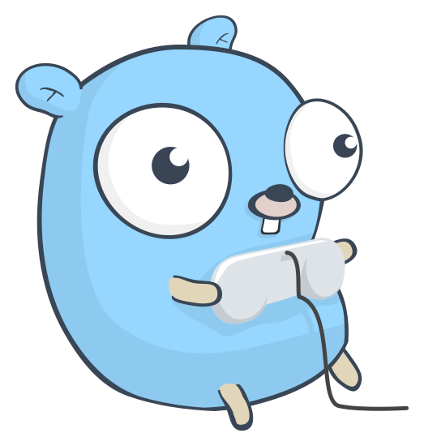

# Hi! I'm [@BarkinBalci](https://github.com/BarkinBalci) — here's today's gopher 😊

<!-- GOPHER_START -->

<!-- GOPHER_END -->
 
<i>Gophers crafted by <a href="https://github.com/egonelbre/gophers">@egonelbre</a> 💙</i>

 

